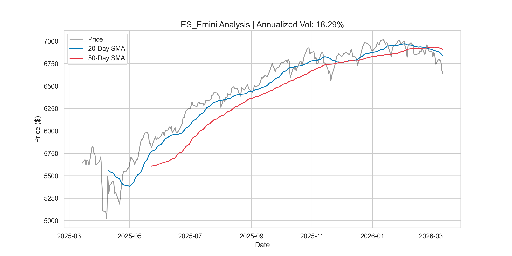
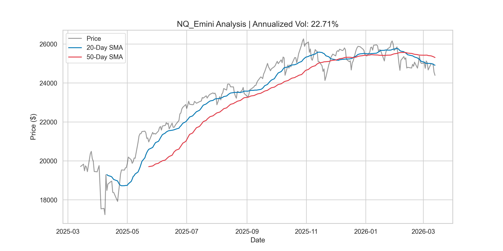

#  Automated Futures Market & Volatility Pipeline
### Python-Based Financial Engineering Project

This repository features a professional-grade analytical tool designed to monitor and visualize market regimes for **ES (S&P 500)** and **NQ (Nasdaq 100)** futures. Developed as a freshman data science major, this project demonstrates end-to-end data engineering: from API ingestion to statistical modeling and automated reporting.

---

##  Key Features:

* **Live Data Ingestion:** Automates retrieval of OHLC (Open, High, Low, Close) data via the **yfinance API**, replacing manual data entry with programmatic, reproducible workflows.
* **Statistical Volatility Modeling:** Implements a mathematical engine to calculate annualized volatility using logarithmic returns, scaling daily standard deviation by $\sqrt{252}$ to quantify market risk.
* **Technical Indicator Engineering:** Developed vectorized Simple Moving Average (SMA) crossovers (20/50 day) using **Pandas** to identify momentum shifts and trend directions.
* **Automated Visualization:** Generates high-fidelity, publication-quality dashboards using **Seaborn** and **Matplotlib** for rapid assessment of price action vs. trend indicators.
* **Object-Oriented Architecture:** Designed using Python **Classes** and **Methods** to ensure the codebase is modular, scalable, and adheres to DRY (Don't Repeat Yourself) principles.

---

## Tools Used:

* **Language:** Python 3.9.6
* **Data Science:** `Pandas` (Wrangling), `NumPy` (Math/Statistics)
* **Visualization:** `Matplotlib`, `Seaborn`
* **API Connection:** `yfinance`

---

## Sample Output
The program automatically generates dashboards for each asset tracked. These visual reports provide a snapshot of current price trends relative to historical volatility.

| S&P 500 (ES) Analysis | Nasdaq 100 (NQ) Analysis |
| :--- | :--- |
|  |  |

---

## Project Structure:

* `market_engine.py`: The core logic containing the `MarketAnalyzer` class and mathematical functions.
* `main.py`: The execution script used to initialize the pipeline for specific futures contracts.
* `requirements.txt`: Documentation of all external dependencies for environment reproducibility.

---

1. **Clone the repository:**
   ```bash
   git clone [https://github.com/anu0331das/Market_Analyzer_Project.git](https://github.com/anu0331das/Market_Analyzer_Project.git)
